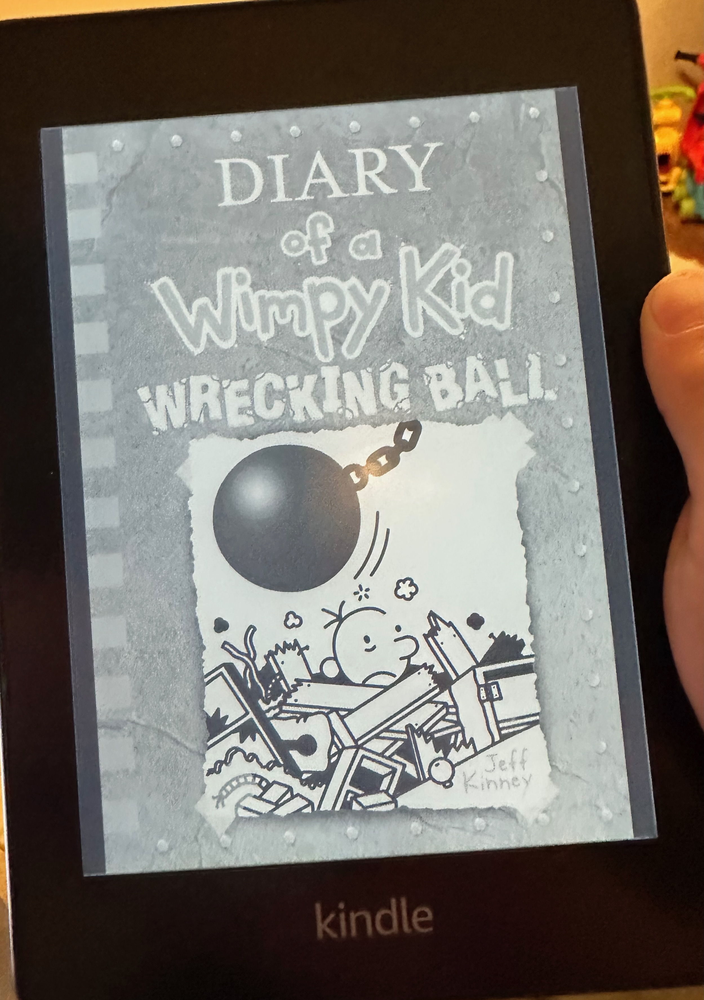

## The Book
**Title:** Diary of a Wimpy Kid: Wrecking Ball
**Author:** Jeff Kinney
**Pages:** 219

<!--more-->

## What Happened
It's about a kid who has a best friend.  His best friend's name is Rolly.  So, it's not really about a wrecking ball, but that describes the last part of the story.  It kind of tells you what's going to happen at the end of the story.

So, the first part of the story is when the main character is digging through his closet.  It has toys.  Some of them he doesn't need anymore.  Then he starts a yard sale.  In the second part of the story is when the hot tub almost killed the main character which is a kid!  In the middle of the story, a wrecking ball comes.  But, on the cover, the wrecking ball is crushing the kid.  That doesn't happen in the story.  It kind of feels like a wrecking ball.

## I liked this book because
I felt energized when the main character which is the kid went on the roof, and was climbing everywhere.  That was fun!  He was climbing over the house!

## My Rating
⭐⭐⭐⭐⭐
