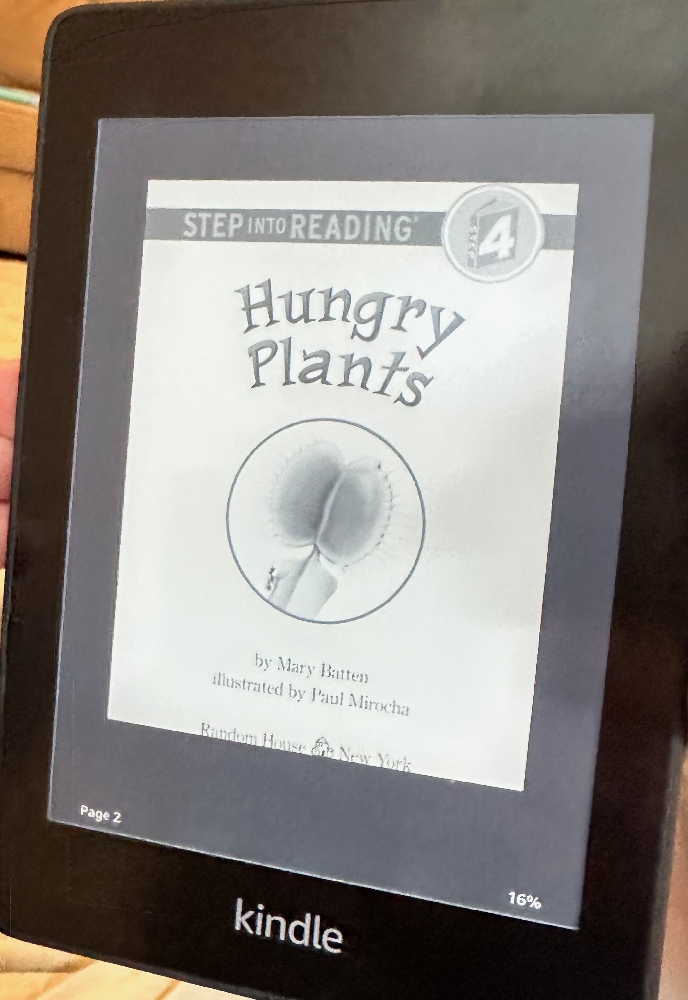

## The Book
**Title:** Hungry Plants
**Author:** Mary Batten

<!--more-->

## What Happened
The book teaches us about plants that eat bugs!  So, one of them is called Venus Fly Trap.  There are a thousand kinds of Venus Fly Traps, and other carnivorous plants.

I learned that bladderworts are another kind of carnivorous plant that also eats bugs.  But be careful!  They are deadly!

## My Rating
⭐⭐⭐⭐⭐
