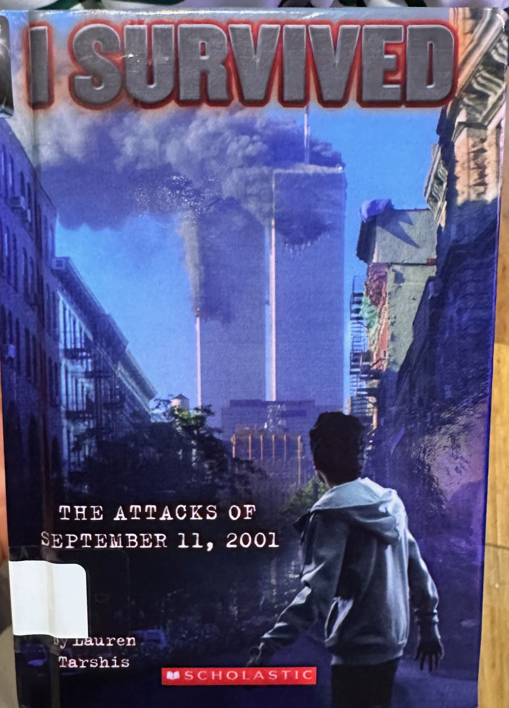
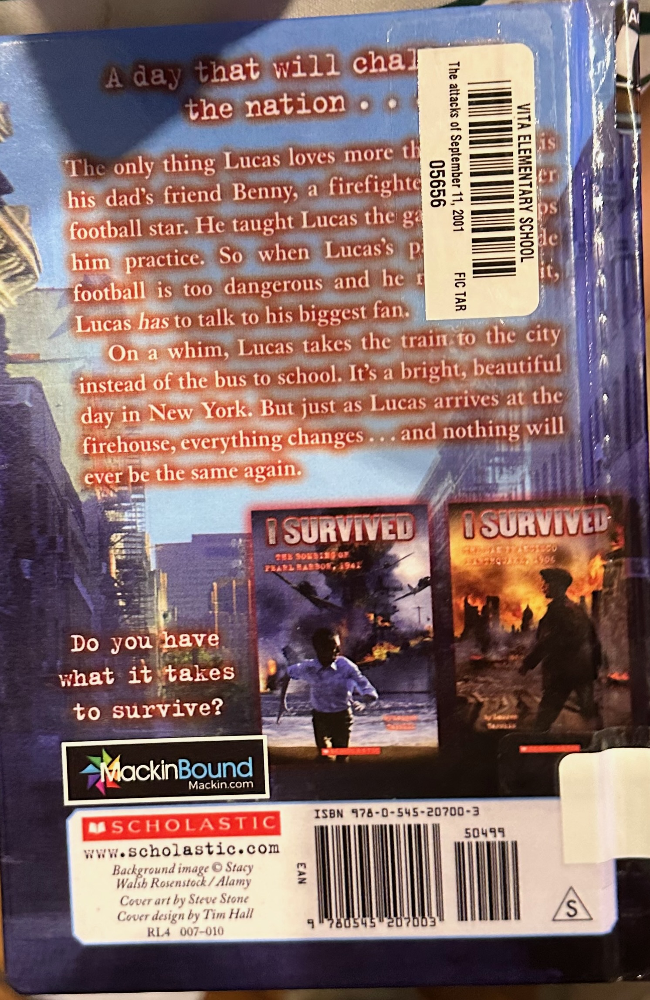

## The Book
**Title:** I Survived the Attacks of September 11 2001
**Author:** Lauren Tarshis
**Pages:** 82

<!--more-->

## What Happened

The book is kind of about football.  The person who survived talks about football in the first 3 or 2 chapters.  The person who survived was a kid.  The kids was 12 years old.

The story only talks about a plane crashing into a tower and then another plane crashing into the second tower of the World Trade Center in New York City.

When his parents say he needs to quit football, Lucas has to talk to his biggest fan: Uncle Benny.  He was right next to the tower that had been crashed by the planes.  The World Trade Center is made out of 2 buildings.  Today, it's made out of **4 buildings**!  Can you believe that?!

His dad is a fire fighter.  When the planes crashed they turned into fire balls!  They explode out of the buildings.  In the book cover, you can see that one of the towers has a hole in it.  That's where the fire ball exploded.  When a piece of one of the buildings fell down, 4 people out of a total of 6 are not Lucas's family.  They rushed into a building.  At first, Lucas thought the whole universe ended!  The youngest girl was crying.  She thought it was another plane that crashed.  Another person said she felt that too.  Lucas' dad said that was not true, it was a piece that fell down from one of the buildings.

Dad told the building operator to get wet cloths to give to all the people.  It is not ok to breathe the dust, or else they would get a toxic heart attack or something like that.  I don't basically know what happens if you _did_ breathe the dust.  All I know is that it didn't kill the people because of the cloths.  Lucas could feel the dust going into his skin.  

The door was shut tight.  Lucas' dad used an axe to chop down the window of the door.  When they got out, Lucas' dad said, "it's gone".  But only Lucas could hear dad's voice.  Lucas said, "what's gone?"  Dad said, "one of the towers is gone."  In the story, both of the towers collapsed I think.

2 more planes crashed.  One crashed into the Pentagon.  The other one crashed in a field in Pennsylvania (where the Eagles are -- the Eagles are a football team).  The plane that crashed in the field in Skyville was supposed to crash into the White House or the capital in Washington D.C..

## I liked this book because

The story was exciting, even though I don't like that the planes killed so many people.

## My Rating
⭐⭐⭐⭐⭐
