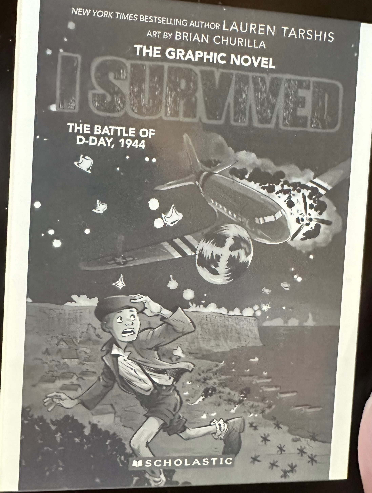

## The Book
**Title:** I Survived the Battle of D Day 1944
**Author:** 
**Pages:** 41

<!--more-->

## What Happened
It's about a boy named Paul surviving the Battle of D-Day. D-Day is basically the bombing of Pearl Harbor. Paul got wrapped in the head by a rock. It knocked him into a decent sleep. He could not wake up. When he woke up, the battle was still going. He ran away to his tower. 

They spun a bicycle wheel to power a radio 3 days later.

## I liked this book because
The fire was cool because it had animation.

## My Rating
⭐⭐⭐⭐⭐
