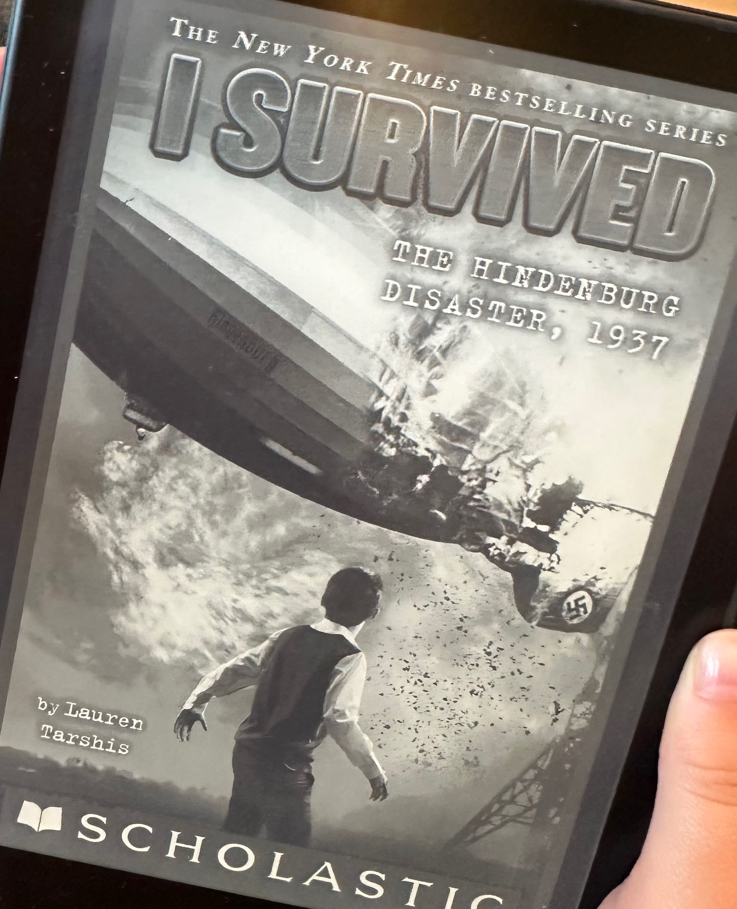

## The Book
**Title:** I Survived the Hindenburg Disaster 1937
**Author:** Lauren Tarshis

<!--more-->

## What Happened
The book is about a boy surviving the Hindenburg disaster. His sister Gertie needs to get to a hospital in New York. She is super sick. The Hindenburg is landing in New York. But just about when it's about to land.

The Hindenburg is doomed. Because a bomb had been hatched on it, and it's exploding and making the Hindenburg tip down.   People jumped out of the windows of the Hindenburg.  They smashed the windows open.  When Hugo jumped out of the Hindenburg, fires were spreading around him.  He curled up into a ball, and didn’t die, because one of the water tanks in the Hindenburg crashed down.

## I liked this book because
The part where they smashed open the windows was strategic!

## My Rating
⭐⭐⭐⭐⭐
