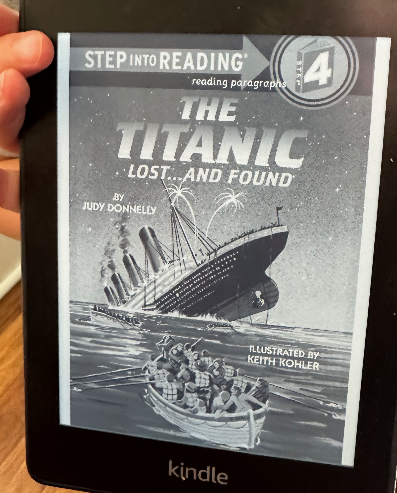

## The Book
**Title:** The Titanic — Lost...and Found
**Author:** Judy Donnelly

<!--more-->

## What Happened
It's about a ship sinking that was found again.  It wasn't supposed to sink.  It had doors that would shut the water.  The captain makes this work, and if it's already flooded the water would be trapped.  The doors are made out of steal so they can't go in.  It can move up to 4 doors.  They activate by the captain pulling a lever.

But it sunk!  Because 5 doors were flooded.  

## My Rating
⭐⭐⭐⭐⭐
