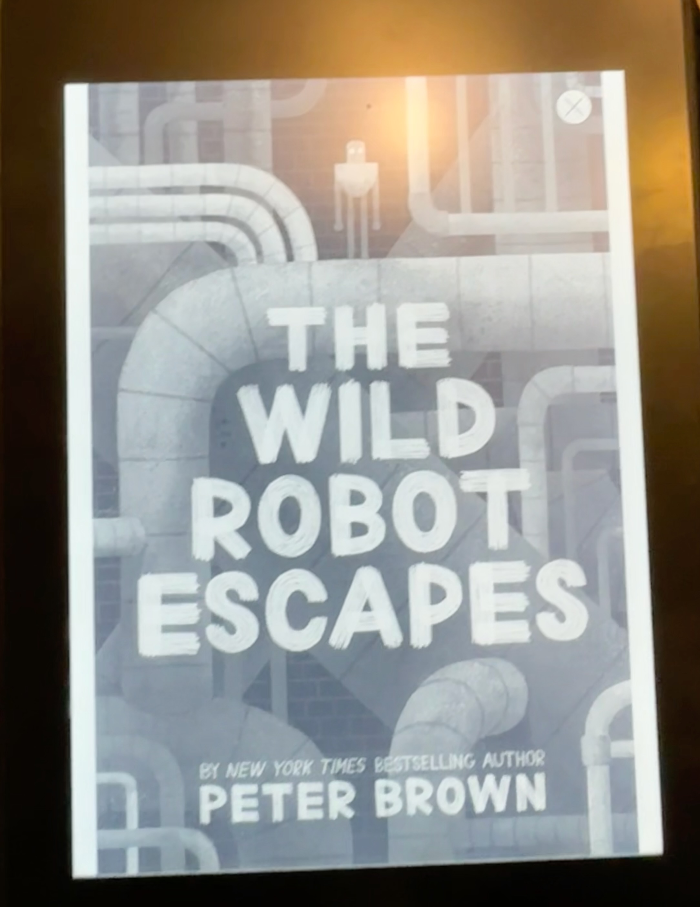

## The Book
**Title:** The Wild Robot Escapes
**Author:** Peter Brown
**Pages:** 297

<!--more-->

## What Happened
It was about a robot escaping from a farm.  The robot tried to run away once.  But it couldn't because the owner of the farm could track the robot because the robot had a transmitter. There were children on the farm. The children helped the robot remove its transmitter. They removed the robot's transmitter. 

The children worked overnight to remove the robot's transmitter. The children's names were Jaya and Jad. Jaya and Jad failed a lot of times, but at the end of the night, they finally fixed it.  At the beginning, where they just got started to work inside the barn, they removed a lot of tubes and a lot of boxes. Suddenly, they didn't even know where anything was supposed to go. 

The second time when the robot went away, her son, which is a goose, flew with her.  The goose's name is Bright Bell. Bright Bell led the way. Usually, they head north to go home because that's the way they usually migrate from the island, which is their home. They did not make it anyway. They took a train back to the city for no reason, and Bright Bill was on the top of the robot car of the train. The only one who was allowed to be in the people seat or service form, so the rest have to go in the back.  The robots were just standing, not really doing anything, I think.Before the robot went to the train, the robot met a ram. The ram charged at her, but the ram didn't Need to Run into the robot.The robot is wild because she can communicate with animals.And then she got to the city.

There were hundreds of pigeons back in the city where the farm was.    One of the  Pigeons named Gay Beak was dead. Bright Bill was looking for her, and she would guide Bright Bill back to the robot. But that did not happen, because Gay Beak is dead.Lots of airships came battling to take the robot away. The pigeons fought in the battle. The robot called to the pigeons to stop the battle. She can handle it herself. But the pigeons were lost in a battle vs Freedom.  The game vs. Freedom was kind of tied, but the poor robot was lost. Her leg got shot by a rifle, and I think her body powered off. She went back to the factory where she was made and got destroyed, but the person who made her had a secret. There's another robot of the same model that had the same code number, and it was another lot of robots. The other robot was mounted, and it was another model of the robots, which is the new one. It remembered everything that happened in the other robot's life. I don't know how that happened, but I think the robot probably tracked the other robot's signals of what she was doing. At last, the robot made it home with an airship, one of the  ROK/S airships.

## I liked this book because
 When the robot mounted it, how the other model of the same robot tracked her movements and memories.
## My Rating
⭐⭐⭐⭐⭐
