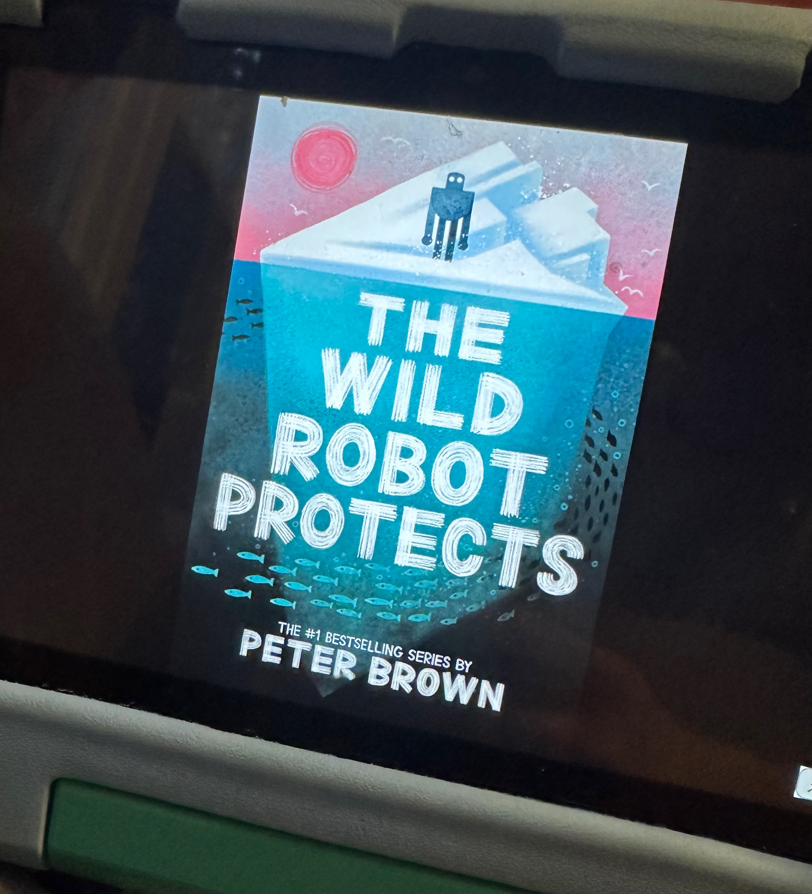

## The Book
**Title:** The Wild Robot Protects
**Author:** Peter Brown
**Pages:** 281

<!--more-->

## What Happened 

A robot named Roz tries to protect her island from a poison tide. The poison tide is destroying her island. It made all of the water supply drain. It set up a wildfire. Water cannot stop the wildfire. 

Roz goes on a journey to stop the poison tide, but there's hundreds of miles to go. The ancient shark which is the one that is going to help Roz is in the northern ocean, which is right under the guiding northern star. That's where the shark lives. The shark is powerful. The Shark tells Roz to be violent. 

There was a station causing the poison tide with toxic dust. The poison tide is made out of toxic dust. The station is called the Juggernaut.  The Juggernaut is floating!! Because of two engines. 

The robot's animal friends help destroy the Juggernaut's engines for the Juggernaut to sink, causing electricity problems and the Juggernaut explodes and floats into the depths. Roz saves the humans inside the Juggernaut.

The poison type has not stopped yet because the mining robot is still working. It has not completed its task. The robot gets captured by the robots. The animals push the Juggernaut towards the robot that's attacking the robots. And Roz is doomed, and that robot is doomed, and the Juggernaut is doomed because it will explode. 

The robot survived and went back to our island. She's happy to see her friends and family again. 

## I liked this book because

I liked when the animals broke the engine and made the Juggernaut catch on fire and made the communication and electricity problems.

## My Rating
⭐⭐⭐⭐⭐
