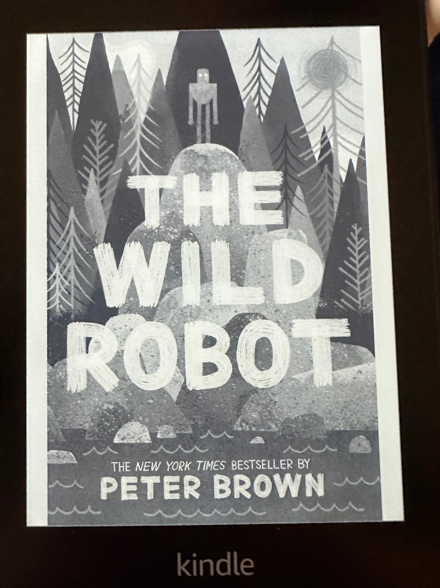

## The Book
**Title:** The Wild Robot
**Author:** Peter Brown

<!--more-->

## What Happened

It's about a robot helping other animals.  He built lodges for them!  Some of them were too late for the lodges because they froze to death.  They froze because there was a big, big, big blizzard.  There was so much snow up to their nest!

At the end of the story, three meany ricos came.  They tried to take the robot away.  Fortuneately, they died.  But the robot broke.  It went into the ricos air ship.  It went to a factory.  The robot had a son.  Its son was a gosling.

## What I liked most about this book

I liked it when the Ricos died.  It was a very interesting part because all of them died because of the animals.  One of the animals broke their bones.

## My Rating
⭐⭐⭐⭐⭐
