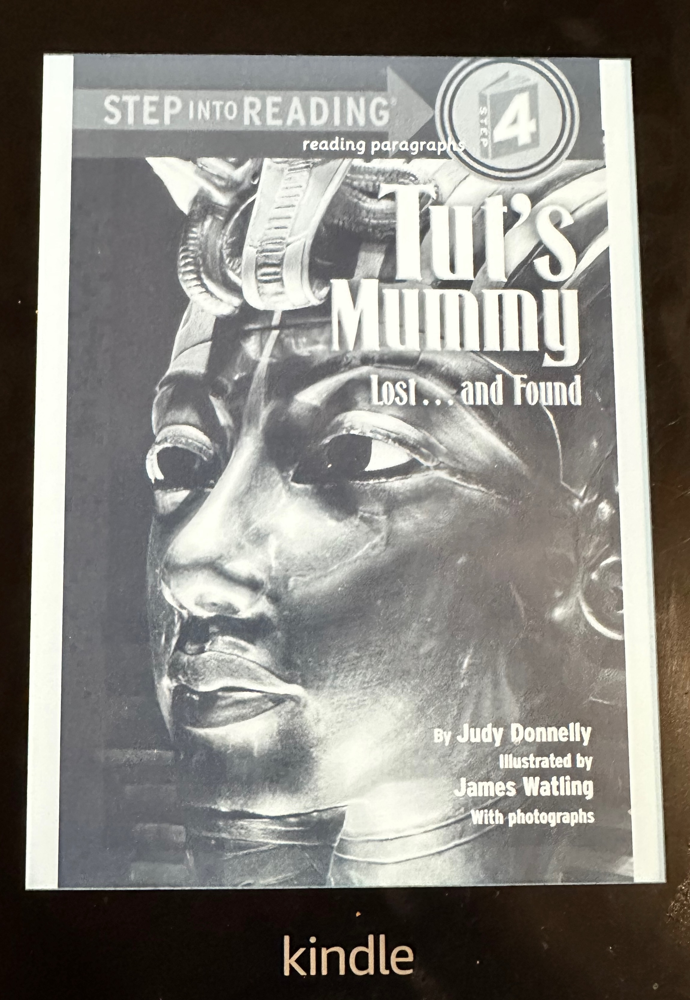

## The Book
**Book Title:** Tut's Mummy: Lost...and Found
**Author:** Judy Donnelly
**Pages:** 41

<!--more-->

## What Happened
A king died when he was 18.  His name was King Tut (for short).  He became a mummy.  The people that lived in Egypt -- he was the King of Egypt -- they made him a mummy.

He was buried in a very special place.  2 people found him years later.  Like 500 years later.  One of them died because of a bug bite.

## My Favorite Part
When one of the people who found him died, that was very interesting.

## My Rating

⭐⭐⭐⭐
